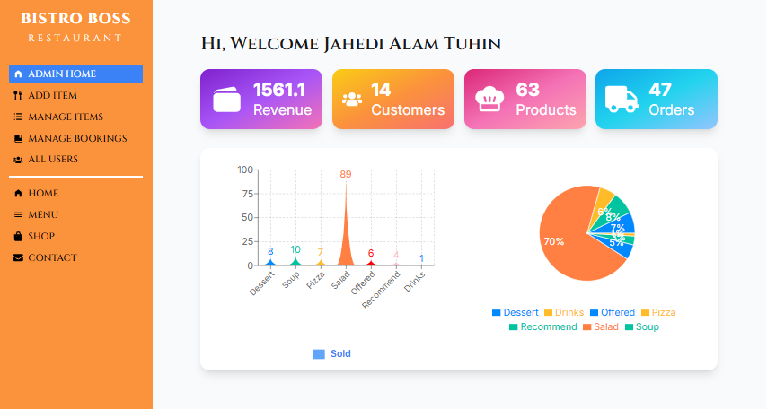
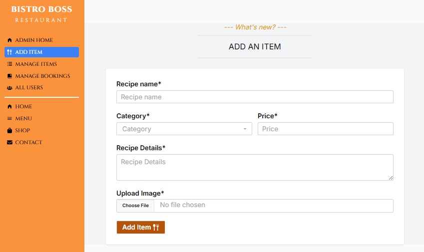
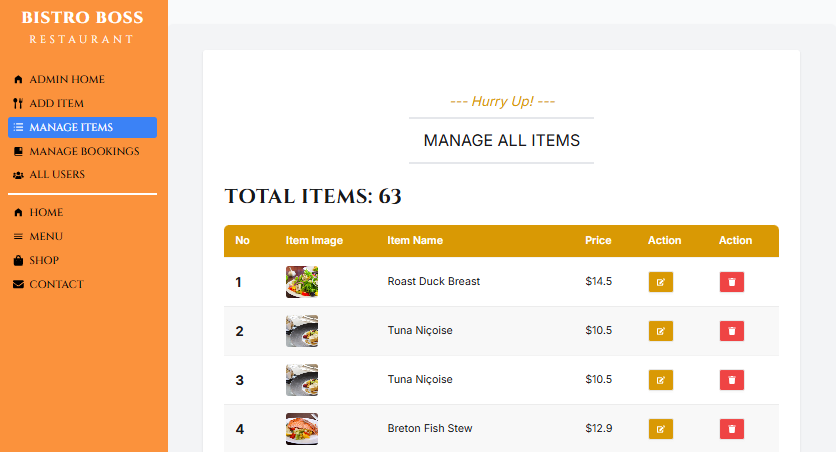
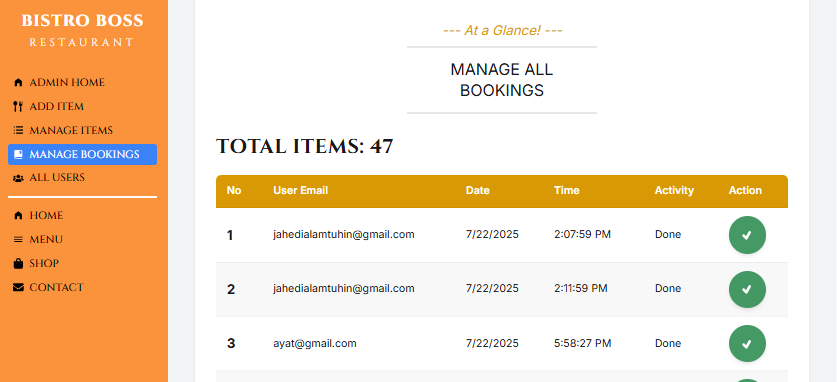
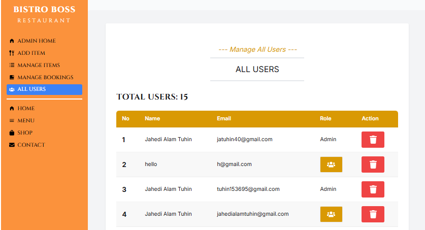

<div align="center">

<!-- Cover Image -->


<!-- Logo & Title -->


<h1 style="background: linear-gradient(90deg, #FF8C00, #FF6347, #D2691E); -webkit-background-clip: text; -webkit-text-fill-color: transparent; font-size: 3.2em; font-weight: 900; margin: 10px 0;">
  Bistro Boss Restaurant
</h1>

<p><strong>🔥 The Ultimate Online Restaurant Ordering & Management Platform</strong></p>

<!-- Animated Tech Badges -->
<p>
  
  
  
  
</p>
<p>
  
  
  
  
</p>

<!-- Quick Links -->
<div style="margin: 20px 0;">
  <a href="https://bistro-boss-97f52.web.app">
    
  </a>
</div>

</div>

---

### 🌈 Why Bistro Boss?

> 🍽️ **From menu to management** — Bistro Boss is a **full‑stack restaurant solution** built for owners, developers, and food lovers.  
> 💡 Clean UI, secure payments, and powerful admin tools — all in one place.

---

## 🌟 Features That Shine

| ✅ Feature | 🎯 Benefit |
|----------|-----------|
| 🍔 **Beautiful Menu UI** | Swiper sliders + AOS animations for stunning visuals |
| 🛒 **Guest Cart** | Add items without login (saved via `localforage`) |
| 🔐 **Firebase + JWT Auth** | Secure login with role‑based access |
| 💳 **Stripe Checkout** | Real payments with `PaymentIntent` |
| 📊 **Live Sales Charts** | Visualize revenue with `Recharts` |
| ⭐ **Star Ratings** | Interactive feedback with `@smastrom/react-rating` |
| 📅 **Table Booking** | Reserve with date, time, and guest count |
| 🎨 **Parallax & AOS** | Scroll animations for cinematic feel |
| 📱 **Fully Responsive** | Works on mobile, tablet, and desktop |

---

## 🚀 Live Demo

<p align="center">
  <a href="https://bistro-boss-97f52.web.app">
    
  </a>
</p>

✅ Experience the full flow:  
1. Browse the menu  
2. Add items to cart  
3. Log in or sign up  
4. Pay securely with Stripe  
5. View order history in dashboard

---

## 🧪 Tech Stack

### Frontend
- React  
- Vite  
- Tailwind CSS  
- DaisyUI  
- React Router  

### Backend
- Node.js  
- Express.js  
- MongoDB  

### Tools & Libraries
- Firebase Auth  
- Stripe  
- React Query  
- Axios  
- SweetAlert2  
- Recharts  

---

## 📁 Project Structure

```text
src/
├── assets/        # Images, icons, and other static files
├── components/    # Reusable UI components
├── firebase/      # Firebase configuration and setup
├── hooks/         # Custom React hooks
├── layout/        # Layout components (Navbar, Dashboard layout, etc.)
├── pages/         # Page components for each route
├── providers/     # Context providers (e.g., AuthProvider)
├── routes/        # Route configuration
└── utils/         # Helper functions and utility modules
```

---

## 📦 Dependencies

### Core
- `react` – UI library for building components  
- `react-dom` – React DOM rendering support  
- `react-router-dom` – Routing system for navigation  

### Data Fetching & State
- `@tanstack/react-query` – Server state management & caching  
- `axios` – HTTP client for API requests  

### Authentication & Security
- `firebase` – Authentication and backend services  
- `react-hook-form` – Form handling and validation  
- `react-simple-captcha` – CAPTCHA verification for security  

### Payment
- `@stripe/react-stripe-js` – Stripe React integration  
- `@stripe/stripe-js` – Stripe payment SDK  

### UI & Styling
- `tailwindcss` – Utility‑first CSS framework  
- `daisyui` – Built‑in Tailwind UI components  
- `aos` – Scroll animations  
- `swiper` – Touch slider/carousel  
- `react-tabs` – Tab UI components  
- `react-icons` – Icon library  
- `lucide-react` – Modern SVG icons  
- `sweetalert2` – Beautiful alert modals  
- `react-responsive-carousel` – Responsive image carousel  

### Charts & Visualization
- `recharts` – Data visualization & charts  

### Utilities
- `localforage` – Offline storage (IndexedDB wrapper)  
- `match-sorter` – Fuzzy searching and sorting  
- `sort-by` – Sorting utility helper  
- `react-helmet-async` – SEO meta tag management  
- `@emailjs/browser` – Send emails from frontend  
- `@smastrom/react-rating` – Star rating component  
- `react-rating` – Simple rating UI component  

---

## 🛠️ Clone from GitHub

```bash
git clone https://github.com/tuhin360/bistro-boss-frontend.git
cd bistro-boss-frontend
```

---

## 📦 Install Dependencies

```bash
pnpm install
```

---

## 🔑 Setup Environment Variables

Create a `.env.local` file in the root directory and fill it like this:

```env
VITE_apiKey=your_api_key
VITE_authDomain=your_auth_domain
VITE_projectId=your_project_id
VITE_storageBucket=your_storage_bucket
VITE_messagingSenderId=your_messaging_sender_id
VITE_appId=your_appId
VITE_IMAGE_HOSTING_KEY=your_image_hosting_key
VITE_Payment_Gateway_PK=your_payment_gateway_pk
```

---

## ▶️ Run the project

```bash
pnpm dev
```

---

## 🔐 Admin Access (Demo)

- Email: [jhon@gmail.com](mailto:jhon@gmail.com)  
- Password: `*Jhon123#`

---

## 📊 Dashboard Features

- Manage Users (Admin/User roles)  
- Add / Update / Delete Menu Items  
- View Sales Analytics  
- Manage Orders  

### Admin Dashboard Screenshots


<div align="center">
  
  
  
  
  
</div>


---

## 🚀 Future Improvements

- 🔔 Real‑time notifications  
- 📦 Order tracking system  
- 🌍 Multi‑language support  
- 📱 Mobile App (React Native)  

---

## 👨‍💻 Author

**Jahedi Alam Tuhin**  
GitHub: [https://github.com/tuhin360](https://github.com/tuhin360)

---

> 📌 This repo contains the **frontend** for Bistro Boss. Backend runs on a separate Node.js + Express + MongoDB project.

---

## ⭐ Support

If you like this project, give it a ⭐ on GitHub!